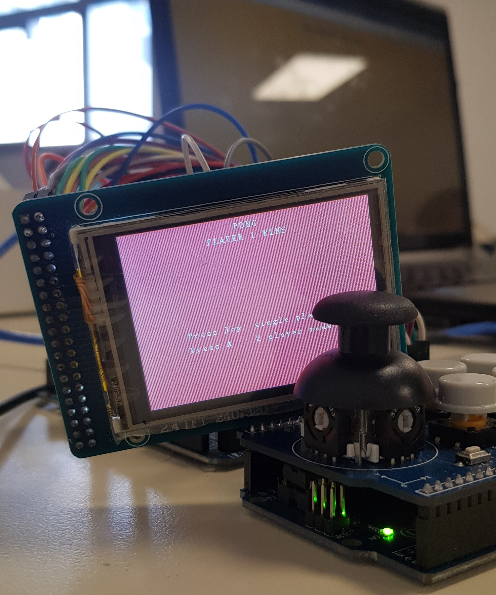

# TLL-ARQII: PONG en display LCD con pagina web hosteada por WeMos
<h4> Trabajo de Laboratorio Final de Arquitectura y Sistema de Elaboración de datos II. </h4>

## Descripción

 Inspirados en el Arcade, se plantea realizar una versión propia del juego PONG que permita jugar tanto en modo de un sólo jugador (single player) contra la máquina como en modo de dos jugadores (two player mode) donde ambos se enfrenten entre sí.

 Para eso se requerirá usar un microcontrolador para diseñar la lógica del juego y el control del mismo: Elegimos usar un Arduino Mega 2560 como nuestro microcontrolador principal; un display LCD 2.4’’ TFT de 240x320 pixeles para poder mostrar 
  el juego; y un joystick shield montado sobre un Arduino UNO para poder controlar el juego
  mediante un joystick y una botonera. 

También se mostrarán los puntajes en una página web que hosteamos mediante un módulo WeMOS D1 E1 Mini - ESP8266 y que se comunicará con el Arduino Mega 2560 mediante comunicación serial 

## Aclaraciones

 El archivo "ARQ 2 - Trabajo Laboratorio Final.pdf" explica detalladamente la resolución, incluyendo toda la investigación realizada y la configuración tanto de software como de hardware 

  

